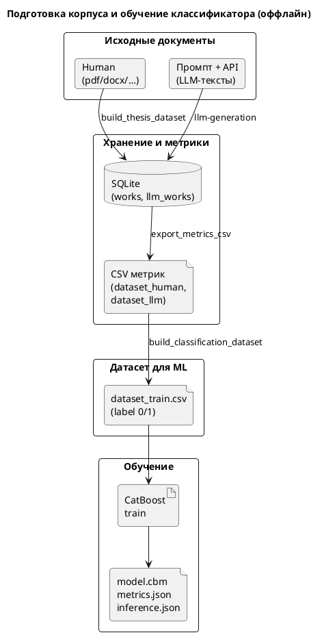
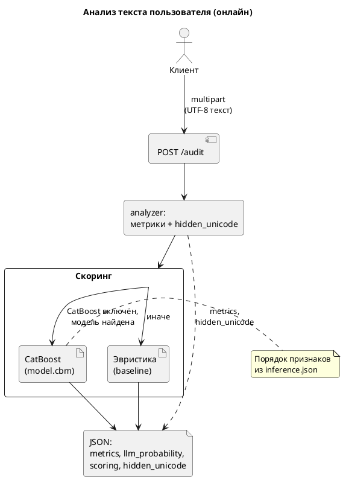
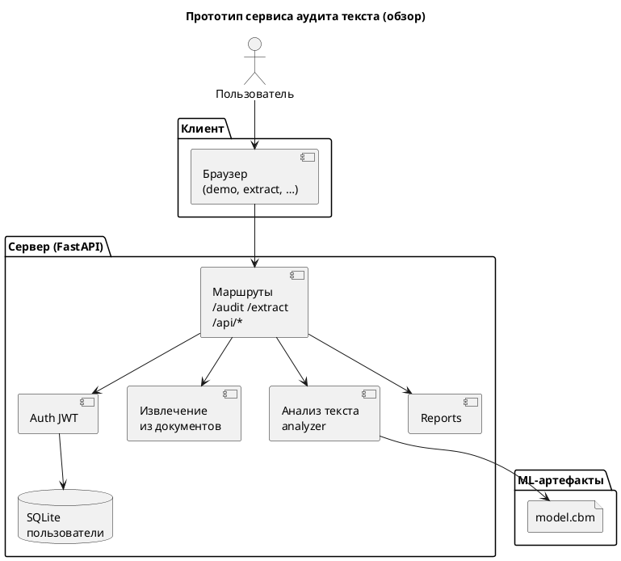
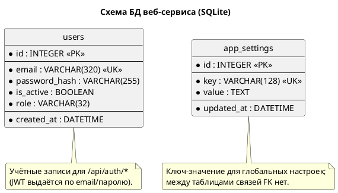

# Диаграммы (PlantUML)

---

## Рис. ML-пайплайн: подготовка данных и обучение CatBoost

---

## Рис. Пайплайн инференса в веб-сервисе (`/audit`)

---

## Рис. Общая схема компонентов сервиса (кратко)

---

## Рис. Схема базы данных веб-сервиса (SQLite)

Используется файл по умолчанию `data/app.db` (или `DATABASE_URL`). Таблицы задаются моделями SQLModel в `app/db/models.py`. Таблицы корпуса ВКР (`works`, `llm_works`) относятся к **оффлайн-пайплайну** и в приложение FastAPI не входят.

